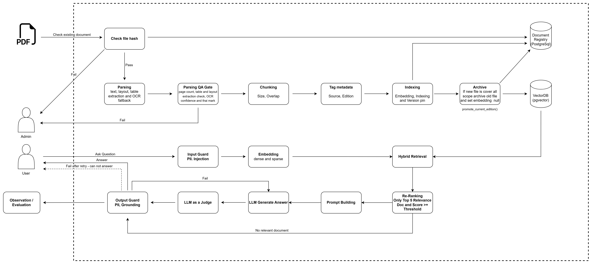

# Thai Pesticide Guidance RAG

ระบบถาม-ตอบภาษาไทยบนคู่มือคำแนะนำการใช้สารป้องกันกำจัดศัตรูพืช ของกรมวิชาการเกษตร

A Thai-language question answering system over the Thai Department of Agriculture's
pesticide recommendation handbooks (คำแนะนำการใช้สารป้องกันกำจัดศัตรูพืช).

---

## What it does

Ask a question in Thai. Get an answer drawn only from the current edition of the handbook,
with a citation you can go and check.

> **Q:** ข้าวโพดเป็นโรคใบไหม้แผลใหญ่ ใช้สารอะไรได้บ้าง
>
> **A:** …
> *ที่มา: คำแนะนำการใช้สารป้องกันกำจัดศัตรูพืช ฉบับปี 2568, หน้า 142*

<!-- TODO: replace with a real question and answer from the system, plus a screenshot or GIF -->

If the handbook doesn't cover the question, the system says so instead of guessing. For
regulatory guidance, "I don't know" is a better answer than a confident wrong one.

## Why I built this

> I'm familiar with RAG concepts and have built local RAG applications for personal use.
> What I hadn't done was deploy one in a real production environment. This project is my
> way of learning that end to end — ingestion, retrieval, evaluation, and the operational
> parts that tutorials skip.

I picked this corpus on purpose. Pesticide guidance is revised every year or two, and the
recommendations genuinely change: a chemical recommended in one edition may be withdrawn in
the next. That makes it a corpus where retrieving the *wrong edition* isn't a slightly worse
answer — it's a wrong answer with real consequences for whoever acts on it.

## The corpus

Three editions from the Thai Department of Agriculture, in Buddhist Era years:

| Edition | Coverage | Notes |
|---|---|---|
| 2565 | fungicide, insecticide, herbicide | Full compendium |
| 2566 | insecticide | Insecticide-only, separate series |
| 2568 | fungicide, insecticide, herbicide | Full compendium, current |

I could not locate a 2567 edition. The system doesn't assume editions arrive on a fixed
schedule, so a gap in the sequence is handled as normal rather than treated as a missing
file.

## Why this is harder than it looks

Two things in this corpus break the obvious approach. Both were found by actually opening
the files, not by assuming.

### The newest file is not the newest edition

The natural way to decide which edition is current is to look at the document date. That
fails here: the 2565 PDF was re-exported through iLovePDF in 2024, so its file metadata
makes it look *newer* than the 2566 edition. A pipeline that trusts file dates will serve
three-year-old guidance as if it were current, and will look perfectly correct while doing
it.

The system reads the edition year printed inside the document instead, and never uses file
metadata to decide what's current.

### A new edition can retire a book that looks nothing like it

The 2566 volume covers insecticides only and belongs to a different publication series than
the 2565 and 2568 compendia — different title, different format. But the 2568 compendium
covers insecticides too, so 2566 is fully superseded by it.

Any rule based on title similarity or "document family" would keep 2566 alive forever. The
system compares *what subject areas each edition covers* rather than what it's called, which
retires 2566 correctly even across series boundaries.

## How it works

Uploading a PDF triggers an automated pipeline: extract the text, run a quality check, split
it into passages, and add them to a searchable index. Once a new edition is indexed, any
edition it fully supersedes is archived — removed from search, but kept on record so the
history stays auditable.

On the query side, a question is screened, matched against the index, and the strongest
passages are passed to a language model that must answer from them and cite where each claim
came from. A second check verifies the answer is actually supported by those passages before
it reaches the user.

Full technical detail, schema, and design rationale: **[ARCHITECTURE.md](ARCHITECTURE.md)**

## How it's evaluated

<!-- TODO: mark as "planned" until the gold set actually exists -->

Evaluation targets the specific failure modes this system exists to prevent, not general
answer quality:

- **Edition correctness** — questions whose answer changed between editions must return the
  current value.
- **Supersession** — questions answerable from the archived 2566 volume must now be served
  from 2568, and must never cite the archived one.
- **Abstention** — for questions the handbook doesn't cover, refusing is the correct answer.
- **Citation validity** — every cited page must exist and must actually contain the claim.
- **Retrieval quality** — recall@k and MRR against labelled passages.

## Status

In progress. Ingestion is being built stage by stage, and each stage lands with the tests
that prove it before the next one starts — 68 of them so far, run in CI on every push,
including the ones that need a real database.

All three editions are in hand and all three pass the gate.

**Working**

- **Text extraction** — PyMuPDF, raw text out with 1-based page numbers preserved for
  citation. pdfplumber was measured against it and rejected: it silently reorders and drops
  Thai vowels and tone marks on the 2568 file.
- **Thai normalization** — the full five-step pipeline, 34 tests. Private Use Area tone
  marks restored to real Thai codepoints, Unicode NFC, running headers and footers removed,
  page numbers and dot leaders stripped, whitespace collapsed.

  Two findings from this stage are written up in [KNOWLEDGE.md](KNOWLEDGE.md). The step
  order is not stylistic: PUA codepoints carry combining class 0, so NFC has nothing to
  reorder until they are repaired, and running the two steps the other way round changes the
  result on 6.6% of mixed-script inputs. Each of those is a pair of lines that look
  identical but hash differently, which quietly breaks deduplication. There is a test that
  fails if anyone reorders the steps.

- **Parsing QA gate** — nine checks over the raw text: page numbering and page-count
  cross-check, blank-page ratio, thin pages, unmapped Thai PUA, symbol-font PUA, Thai
  combining-mark ratio, presence of Thai at all, and presence of the hand-entered subject
  scopes. Each check records what it measured and the threshold it was judged against, not
  just a pass or fail, because the reason is what has to survive in the database.

  The combining-mark floor is the interesting one. It counts Thai marks per Thai consonant,
  since a parser that drops vowels leaves the consonants untouched. All three volumes land
  within 1% of each other — 0.3314, 0.3345, 0.3324 — across two different publication
  series, which is what makes it a fact about written Thai rather than about one book.

- **Ingestion writes** — one document row per volume, written through psycopg, with the
  full QA record stored as JSON. Re-ingesting a file already in the database updates it in
  place while it is still pending, and is refused outright once it is live or archived.
  Document rows are never deleted; that is the audit trail.

  Tested against a real Postgres with pgvector in a container, not a mock, since the
  guarantees that matter here are schema-level. Each test runs inside a transaction that is
  rolled back, so no test can see another's rows.

**Next**

- **Chunking** — prose and dosage tables need different strategies. Splitting a dosage table
  mid-row produces a chunk that states the wrong application rate, which is the most
  consequential failure this corpus allows.
- **Embedding and supersession** — model version pinned per document, and archival that
  removes a superseded edition's passages from search while keeping its record.

**Known gaps**

- The QA gate measures and records, but nothing is blocked yet: there is no chunking stage
  for a failed document to be kept out of. The check that enforces it belongs with the
  chunker, and lands with it.
- The 2565 volume carries 225 private-use characters where tone marks should be, and the
  gate blocked it on four of them. All four are now identified — by rendering the glyphs out
  of the PDF and reading the resulting words, not by trusting a font chart — and the font
  turns out to store one tone mark at several codepoints, picked by the shape of the
  consonant underneath. Four more codepoints complete that block by symmetry but appear in
  no edition, so they are deliberately left unmapped: a guessed tone mark is a silently
  different Thai word, while a missing one is a loud failure.
- Both compendium editions also carry glyphs from symbol fonts in a different part of the
  private use area, three of which are real content — an alpha, a delta and an arrow inside
  chemical group names. Repairing them needs to know which font each span used, which the
  extraction layer does not currently carry, so for now every occurrence is counted and
  recorded per document rather than silently passed through.
- One page of the 2565 volume extracts with a handful of its lines reversed.
- Subject scopes are entered by hand, which makes supersession dependent on a human getting
  them right. The QA gate checks they are present; it cannot check they are correct.
- The retrieval side, evaluation set, and service have not been started.

## Disclaimer

This is a portfolio project. It is not an official Department of Agriculture service, and
its answers should not be relied on for real pesticide application decisions. Always consult
the published handbook.